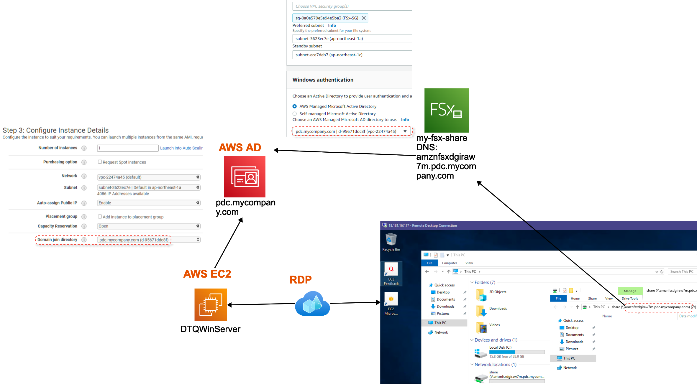

# aws-ad-fsx-win-demo 🐳

## reference
[awsstudygroup](https://000025.awsstudygroup.com/vi/)

## AWS EC2
1. ### launch
  - Domain join directory: Chọn directory mà bạn đã thiết lập trước đó

## AWS FSx
- Ở mục Windows authentication:
- 1. Chọn AWS Managed Microsoft Active Directory
- 2. Sau đó chọn Directory mà bạn đã tạo

## AWS EC2
1. ### RDP
  - FSx: sao chép nội dung DNS name để tiến hành Map Network Drive trên Windows (VD: \\amznfsxdgiraw7m.pdc.mycompany.com\share)
  - RDP: mở File Explorer và nhấn chuột phải vào This PC, chọn Map network drive…
  - Folder: Nhập vào nội dung \\<FSx DNS Name>\share (VD: \\amznfsxdgiraw7m.pdc.mycompany.com\share)
  - Hộp thoại yêu cầu bạn nhập username và password để chứng thực. Bạn hãy nhập thông tin tài khoản Admin domain đã thiết lập ở AWS AD